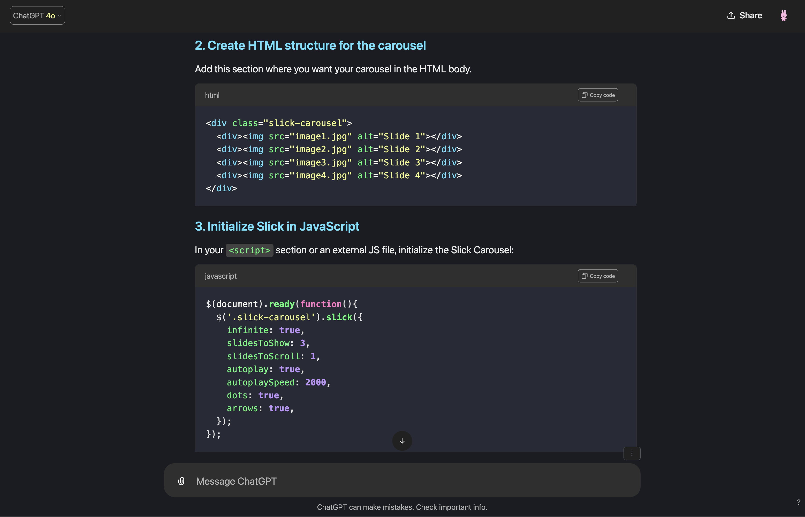

# Dracula Theme for [ChatGPT](https://chat.openai.com/)

> A dark theme for [ChatGPT](https://chat.openai.com/).

## Install

**Chrome Web Store** - Extension

[ChatGPT Dracula Theme Chrome Extension](https://chromewebstore.google.com/detail/chatgpt-dracula-custom-th/ocmahjmcabkidkpmfhdiipnaajlmkfba)

## Community

- [Twitter](https://twitter.com/draculatheme) - Best for getting updates about themes and new stuff.
- [GitHub](https://github.com/dracula/dracula-theme/discussions) - Best for asking questions and discussing issues.
- [Discord](https://draculatheme.com/discord-invite) - Best for hanging out with the community.

## Dracula PRO

## License

[MIT License](./LICENSE)
